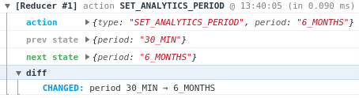

# Reducer Logger

A simple logger for reducer functions, inspired by the middleware [redux-logger](https://github.com/LogRocket/redux-logger).

This logger provides a diff of the previous state / next state via [deep-diff](https://github.com/flitbit/diff).

Written in typescript.



## Installation

```bash
$ npm i --save @fthebaud/reducer-logger
# or
$ yarn add @fthebaud/reducer-loggerreducer-logger
```

## Usage

Just wrapp the reducer using the wrapReducer function.

Second parameter is an optionnal configuration object.

```js
//TODO
```

## Options

| Name     | type    | default |
| -------- | ------- | ------- |
| disabled | boolean | false   |
